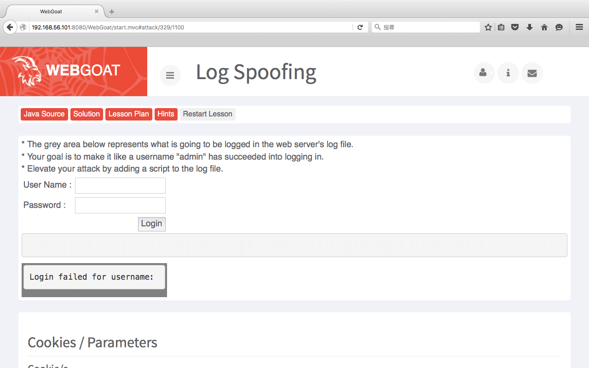
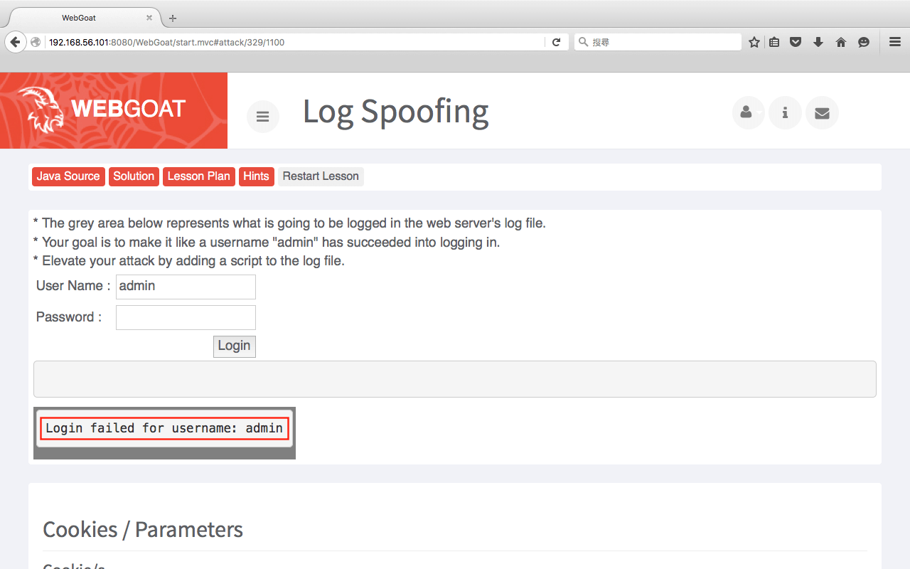
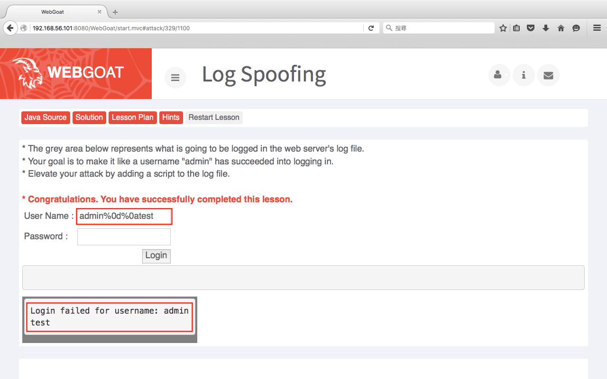
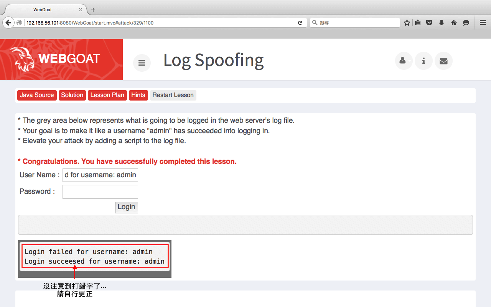
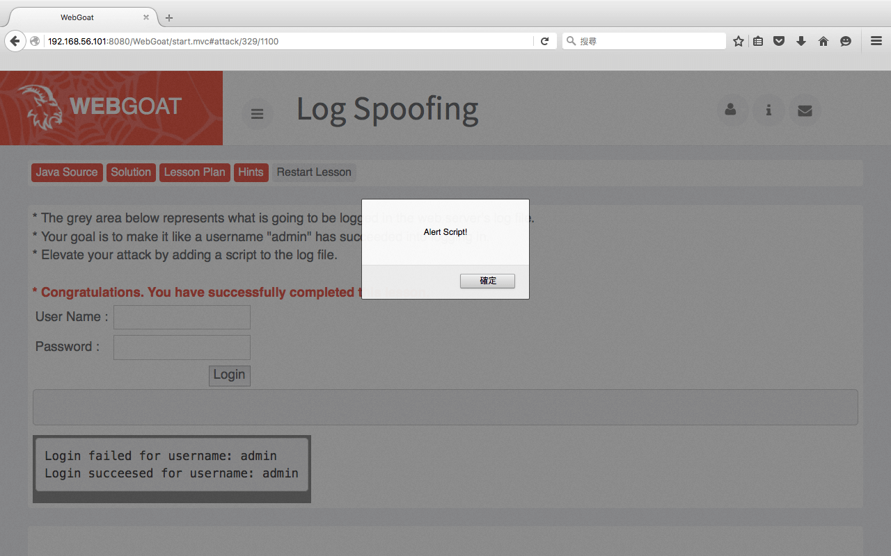

Log Spoofing
====
使用工具
----
*   無

* * *

這題要我們嘗試「看起來」用admin的身份成功登入，下方灰色的區塊就是伺服器記錄檔的內容。
廢話不多說，先嘗試登入看看。可以看見當我們只輸入了admin沒有輸入密碼時，很正常的無法登入，記錄檔中也確實記錄了admin失敗的登入動作，而且是把User Name欄位的內容放進記錄檔。

既然是文字檔，那麼我們可以嘗試讓它「換行」。在寫C程式的時候，換行的動作就是「\n」，其實不同的作業系統換行的規則有一些不同。
在Windows裡，每一行的結尾是「\n\r」、在Unix裡是「\n」、在Mac裡是「\r」，那麼「\r」又是什麼？常見的中文翻譯就叫做「回車」，意思就是把螢幕上的光標一到那一行的最前面。但是如果單純輸入「\r\n」會被當成字串處理，這時我們可以轉換成十六進位看看作業系統會不會認得並且進行換行。

`admin%0d%0atest`

可以看見WebGoat已經在恭喜突過這一關了...下方的記錄檔也確實換行了。不過我們就還是照題目要求的嘗試「看起來」用admin的身份成功登入再試一次。

`admin%0d%0aLogin succeeded for username: admin`

的確看起來就好像成功登入了一樣... 

最後在嘗試寫入一個alert script看可不可以被執行：
`admin%0d%0aLogin succeeded for username: admin`

