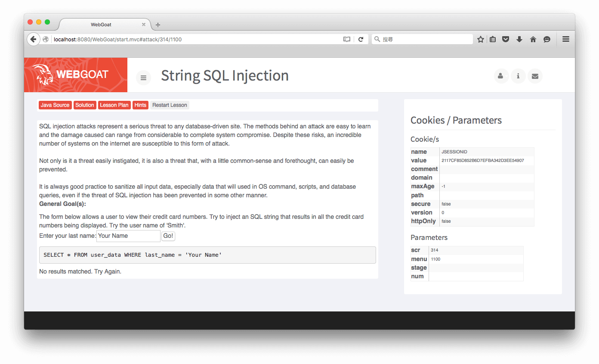
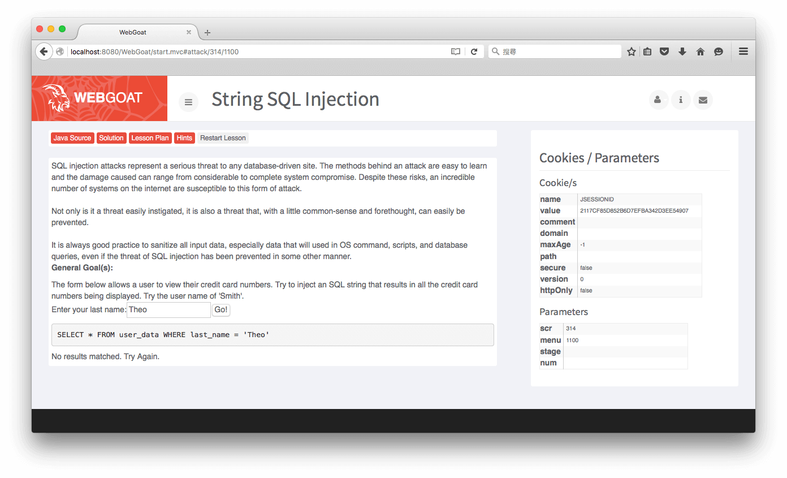
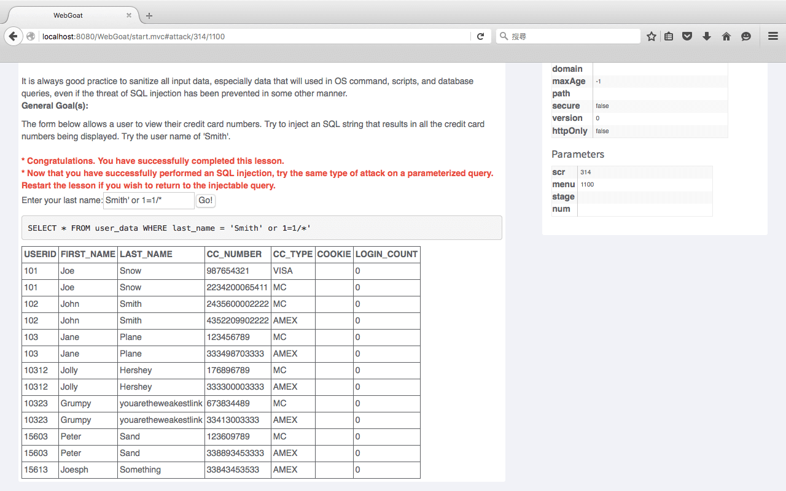

String SQL Injection
===
使用工具
----
*    無

* * *

這題是一個很基本的SQL字串查詢語句的練習。
首先我試著輸入自己的名字，可以看見下方的SQL語句最後單引號內會變成我們輸入的字串。

接下來我們這題目要求輸入「Smith」來查詢Last Name，下方便列出了所以Last Name是Smith的資料。

既然我們輸入字串後，後端會自動加入前後的單引號，那我們可以自己輸入一個單引號來結束這個字串並且在後面加入一個恆等式，最後再把後方所有的程式碼註解。
`Smith' OR 1=1/*`

就可以成功列出資料表內所有的資料。

